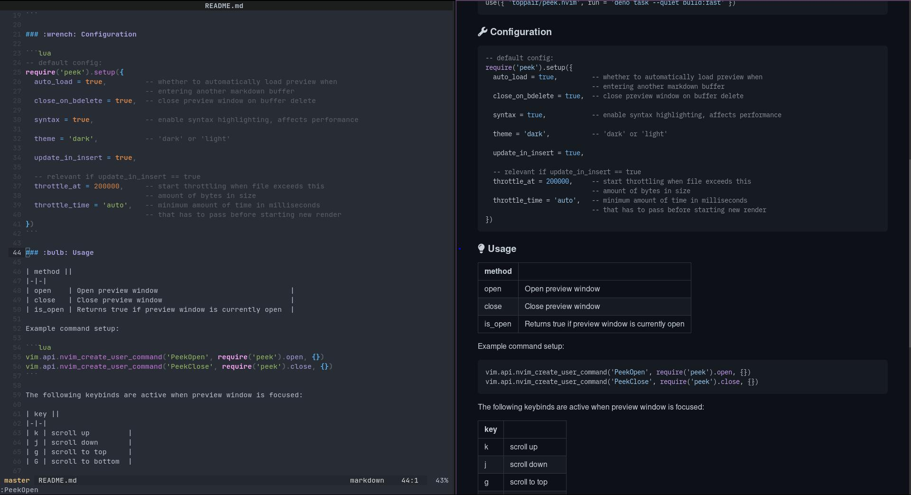

# peek.nvim

*Markdown preview plugin for [Neovim](https://github.com/neovim/neovim)*



### :sparkles: Features

- live update
- synchronized scrolling
- github-style look

### :battery: Requirements

- [Deno](https://deno.land) v1.25.0+

### :electric_plug: Installation

```lua
use({ 'toppair/peek.nvim', run = 'deno task --quiet build:fast' })
```

### :wrench: Configuration

```lua
-- default config:
require('peek').setup({
  auto_load = true,         -- whether to automatically load preview when
                            -- entering another markdown buffer
  close_on_bdelete = true,  -- close preview window on buffer delete

  syntax = true,            -- enable syntax highlighting, affects performance

  theme = 'dark',           -- 'dark' or 'light'

  update_on_change = true,

  -- relevant if update_on_change is true
  throttle_at = 200000,     -- start throttling when file exceeds this
                            -- amount of bytes in size
  throttle_time = 'auto',   -- minimum amount of time in milliseconds
                            -- that has to pass before starting new render
})
```

### :bulb: Usage

| method ||
|-|-|
| open    | Open preview window                               |
| close   | Close preview window                              |
| is_open | Returns true if preview window is currently open  |

Example command setup:

```lua
vim.api.nvim_create_user_command('PeekOpen', require('peek').open, {})
vim.api.nvim_create_user_command('PeekClose', require('peek').close, {})
```

The following keybinds are active when preview window is focused:

| key ||
|-|-|
| k | scroll up         |
| j | scroll down       |
| g | scroll to top     |
| G | scroll to bottom  |

### :mag: Preview window

Use your window manager to set preview window properties. Window title is `Peek preview`.

**[i3wm](https://i3wm.org/) examples:**

```
# do not focus preview window on open
no_focus [title="^Peek preview$"]
```

Use `i3-msg` to manipulate current layout and open preview window at desired position:

```lua
local peek = require('peek')

vim.api.nvim_create_user_command('PeekOpen', function()
  if not peek.is_open() and vim.bo[vim.api.nvim_get_current_buf()].filetype == 'markdown' then
    vim.fn.system('i3-msg split horizontal')
    peek.open()
  end
end, {})

vim.api.nvim_create_user_command('PeekClose', function()
  if peek.is_open() then
    peek.close()
    vim.fn.system('i3-msg move left')
  end
end, {})
```
